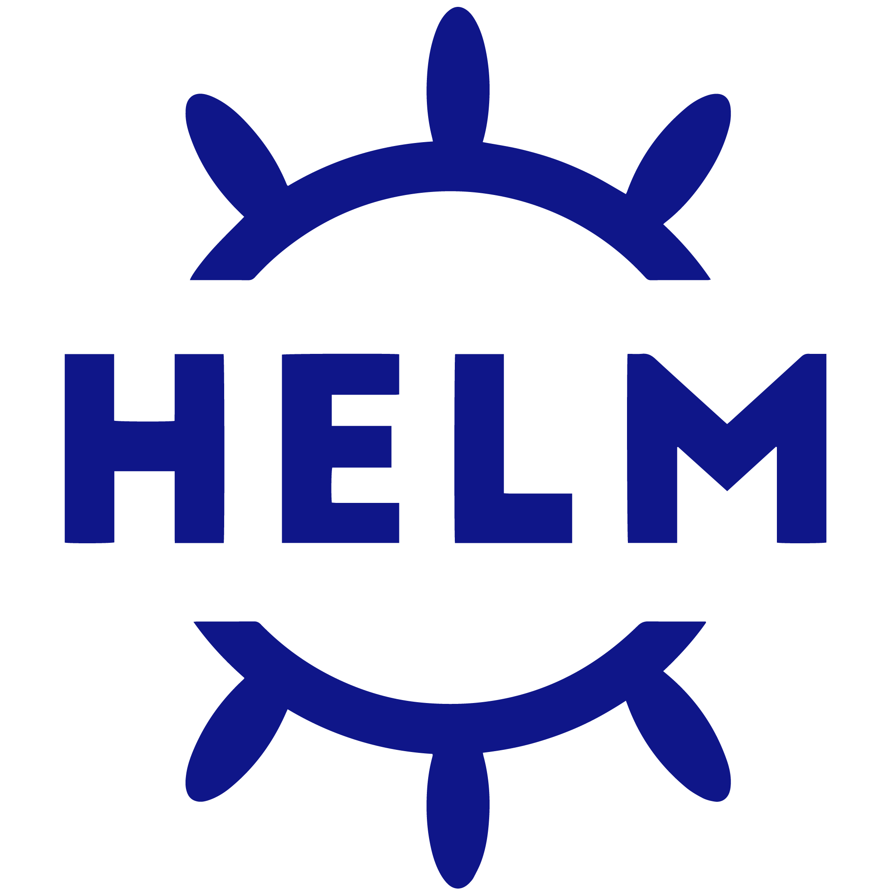

# 👀 Verify that Helm is available

Helm has been installed on this virtual machine alongside an NGINX ingress controller Helm chart.

You can check that Helm is available and its version with this command:

```bash
helm version
```

You should get a message with the build info that looks like this:

```
version.BuildInfo{Version:"v3.7.2", GitCommit:"663a896f4a815053445eec4153677ddc24a0a361", GitTreeState:"clean", GoVersion:"go1.16.10"}
```

# 🚀 The NGINX chart is installed and the pods are running

You can use Helm to show all the charts that are installed on this machine. To do this, run this command:

```bash
helm list
```

You will get a message with the ingress-nginx chart information, it should look like this (note that the status should be deployed):

```
NAME                    NAMESPACE       REVISION        UPDATED                                 STATUS          CHART                   APP VERSION
my-ingress-nginx        default         1               2022-01-06 16:00:34.622220076 +0000 UTC deployed        ingress-nginx-4.0.13    1.1.0
```

Aditionally, you can check that the NGINX pods are running, remember that Helm works over kubernetes. Just run this command to verify that the NGINX pods are up and running:

```
kubectl get pods
```

This should show you the NGINX controller pods:

```
NAME                                          READY   STATUS    RESTARTS   AGE
svclb-my-ingress-nginx-controller-fwrxs       2/2     Running   0          3m49s
my-ingress-nginx-controller-b9d8cddf4-gwlgr   1/1     Running   0          3m49s
```

You can click the check button to finish this track!


